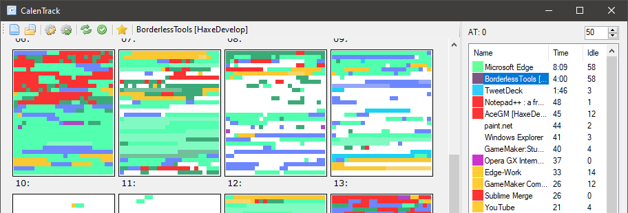

# CalenTrack

This is a novel kind of a time tracker that addresses a thing that has been bothering me in most of these: unless the nature work and workflow allow to simply stick to a timer, measuring time spent on a task is never as simple as checking how long a program was open.

For example, so I might spend 4 hours in Visual Studio writing code, but I also need to do research, and read documentation, and communicate with the client, and thus those 4 hours are now 6, but the existing tools lack the granularity required to tell which minutes of using Discord were sandwiched between code editor activity, or how long you've been staring at MSDN for _this specific task¹_.

\[1] (and even that's only if you are content with transmitting your entire browsing history to a remote server).

This tool aims to make this easier by tracking the foreground application at 5-second intervals and forming a "minimap of activity":

You can then select time intervals to get per-application readings for them, select applications to view active time for, or move the mouse over the minimap/click contents to inspect individual "ticks".

Applications can be grouped or split by title and/or executable path (including regular expressions), which gives adequate granularity.

## Building

A Visual Studio C# project is included and should build without issues after installing the C# tools.

## Configuration

On first launch the tool will create a `config.ini` file next to the executable.

This file can be opened and re-loaded using the toolbar buttons.

The file uses a fairly simple format to define colors, settings, and application rules.

Application rules can use simple inclusion filters (`titleHas`, `pathHas`) and/or regular expressions (`title`, `path`); Regular expressions capture groups can be used to customize the label (such as to split Visual Studio activity by project opened, or browser activity by website).

Options of interest are as following:

- `main`:
	- `scale`: how large a single "tick" is (default is 6x6px)
	- `timeTillIdle`: how long the system should report as idle (in seconds) before the application switches to the semi-transparent "idle" color.
	- `idleAlpha`: opacity for "idle" application ticks.
	- `hourStyle`: `12` or `24`, depending on whether you desire 24-hour display or not.
	- `timeTillBreak`: the tool has an option of reminding you to take breaks every X seconds of activity.
	- `breakTime`: required period of inactivity for above break to end.
	- `breakText`: text to display in CalenTrack title/taskbar button during above.
	- `breakTaskbarKind`: taskbar button dislay style during above. You can set this to "paused" for paused/yellow style or "normal" for progress/green. Custom theme tools are often unable to display non-"normal" button styles.
	- `autosaveInterval`: how often to flush data to disk, in seconds. Good to avoid loss of data in case the system shuts off unexpectedly!
- `colors`:  
	You can define default and custom colors here!  
	These accept both hex (`#RrGgBb`) and `rgb(red, green, blue)` formats; use `$name` keys to define colors to use in other sections.
- `rule`:  
	The configuration file can contain an any number of such sections defining per-application rules;
	- `titleHas`: matches windows with title containing the given string
	- `title`: matches windows with title matching the given regular expression.  
		Capture groups can be referenced in `label` as `$t1`, `$t2`, etc.
	- `pathHas`: matches windows with executable path containing the given string
	- `path`: matches windows with executable path matching the given regular expression.  
		Capture groups can be referenced in `label` as `$p1`, `$p2`, etc.
	- `label`: Shown in top bar and in the summary on the right.  
		If multiple rules produce the same label, their results will be combined.
	- `color`: a hex/rgb/named (`$name`) color to use.

## Use

The tool can be used as-is, but setting up rules for applications can be a good idea to help categorization and review;

Normally you review and restart the session at an interval (e.g. at start or end of a work day/week) while discarding the old one or saving it for later review.

## License

Free for personal use (including for tracking paid work).

Not exactly "enterprise-ready" but feel free to [contact me](https://yal.cc/about/) if you'd like to fund further development.